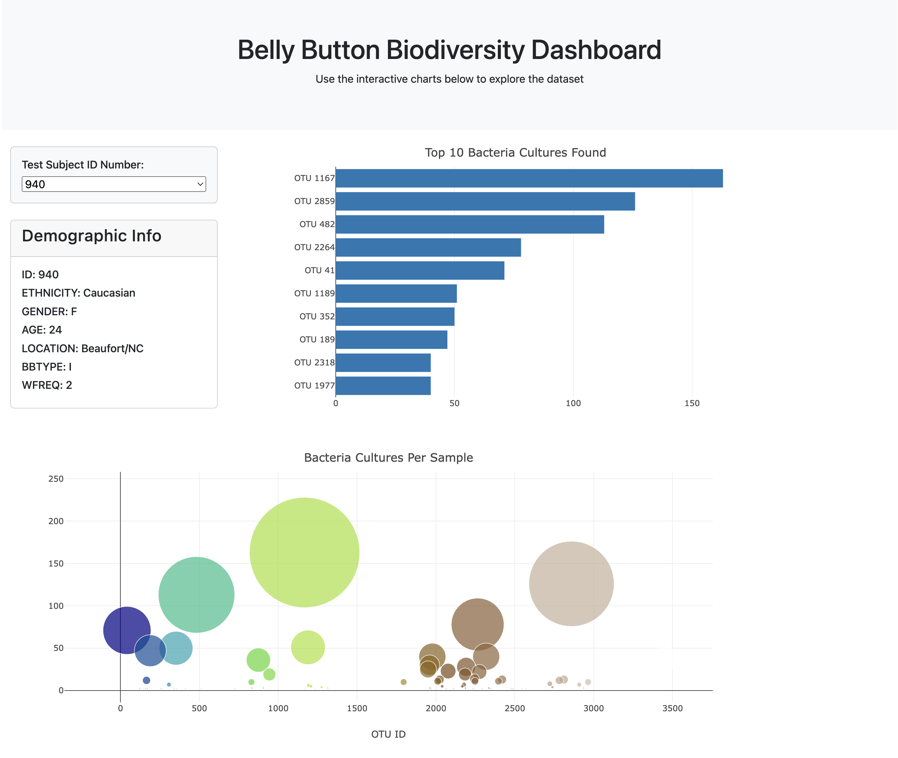

# Belly Button Biodiversity Dashboard



## Table of Contents
- [Overview](#overview)
- [Features](#features)
- [Dataset](#dataset)
- [Technologies Used](#technologies-used)
- [Installation](#installation)
- [Usage](#usage)
- [Deployment](#deployment)
- [License](#license)
- [Acknowledgements](#acknowledgements)

## Overview
The **Belly Button Biodiversity Dashboard** is an interactive web application that visualizes the microbial species found in human navels. This dashboard allows users to explore the biodiversity of bacteria in different individuals and understand the commonality and rarity of various microbial species.

## Features
- **Interactive Bar Chart**: Displays the top 10 microbial species (OTUs) found in an individual's belly button.
- **Dynamic Bubble Chart**: Visualizes all microbial species in a sample, with markers sized according to the number of bacteria and colored by OTU ID.
- **Demographic Information Panel**: Provides detailed demographic information about each test subject.
- **Responsive Dashboard**: Automatically updates charts and information when a new test subject is selected from the dropdown menu.

## Dataset
The dataset used in this project catalogs the microbes that colonize human navels. A small number of microbial species are present in over 70% of people, while the rest are relatively rare. 

The dataset includes:
- **OTU IDs**: Operational Taxonomic Units representing different microbial species.
- **Sample Values**: The quantity of each OTU found in a sample.
- **OTU Labels**: The taxonomic names of the microbial species.
- **Metadata**: Demographic information for each test subject, including age, gender, location, and frequency of washing.

## Technologies Used
- **D3.js**: To load and manipulate the dataset and create interactive charts.
- **Plotly.js**: To create dynamic, interactive bar and bubble charts.
- **HTML/CSS**: For structuring and styling the dashboard.
- **Bootstrap**: For responsive layout and design.
- **JavaScript**: For handling user interactions and updating the dashboard dynamically.
- **GitHub Pages**: For deploying the project online.

## Installation
To run this project locally, follow these steps:

1. **Clone the Repository:**
   ```bash
   git clone https://github.com/maslla100/belly-button-challenge
   ```
2. **Navigate to the Project Directory:**
   ```bash
   cd belly-button-challenge
   ```
3. **Open `index.html` in your Web Browser:**
   - You can directly open the `index.html` file in your browser to view the dashboard locally.

## Usage
1. **Select a Test Subject:**
   - Use the dropdown menu to select a different test subject ID.
2. **Explore the Data:**
   - View the top 10 OTUs in the bar chart and observe the overall distribution of bacteria in the bubble chart.
3. **Review Demographics:**
   - Inspect the demographic information of the selected test subject in the panel on the left.

## Deployment
The project is deployed on GitHub Pages. You can view the live dashboard here:
- [Live Dashboard](https://maslla100.github.io/belly-button-challenge/)

## License
This project is licensed under the MIT License. See the [LICENSE](LICENSE) file for more details.

## Acknowledgements
- **Rob Dunn Lab**: For providing the dataset used in this project. 
- **edX Data Analytics Bootcamp**: For the starter code and guidance.
- **Plotly.js** and **D3.js** communities: For the excellent libraries that made this project possible.

---

